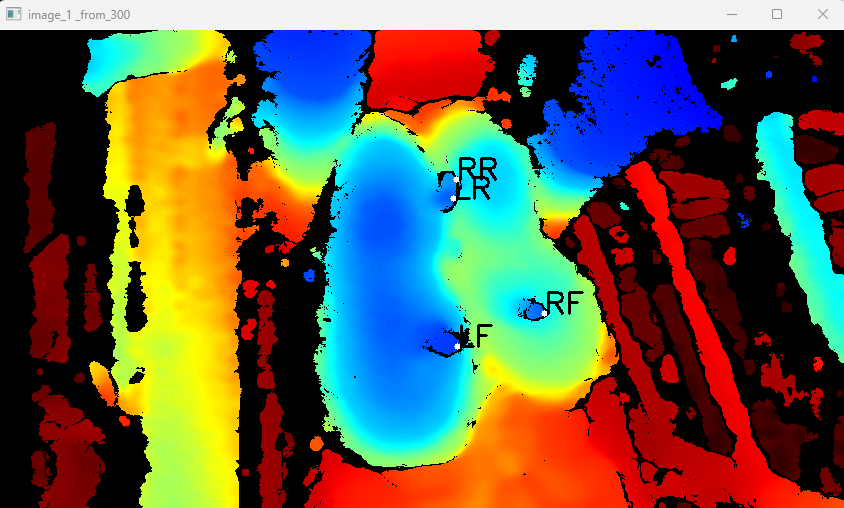
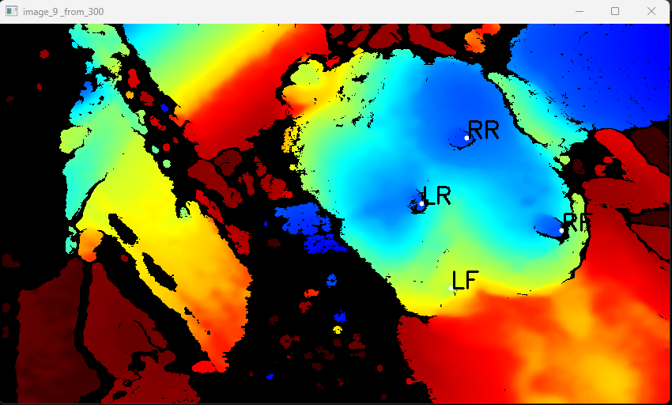
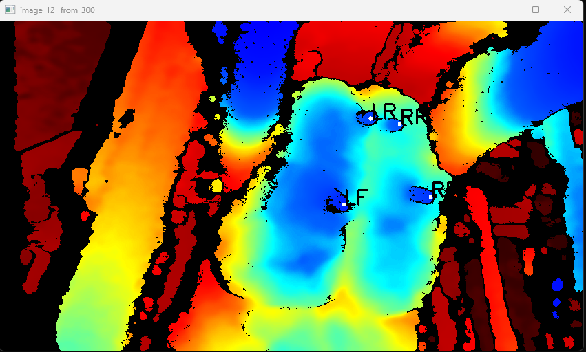

# Udder labels
The frames of 50 cows 25 from each computer (Guilherme, Maria) were labeled for class, segment, and keypoints. 

## Class
<ul>
  <li>0: bad</li>
  <li>1: good</li>
</ul>
Labeling script: <a href="udder_frame_class.py">udder_frame_class.py</a>

### Examples
<table>
  <tr>
    <th>Good</th>
    <th>Bad</th>
  </tr>
  <tr>
    <td></th>
    <td></th>
  </tr>
</table>

## Segments
Labeling script: <a href="udder_segments.m">udder_segments.m</a>

### Examples 
<table>
  <tr>
    <th></th>
    <th></th>
    <th></th>
  </tr>
</table>

## Keypoints
Labeling script
### Examples
<table>
  <tr>
    <th></th>
    <th></th>
    <th></th>
  </tr>
</table>
