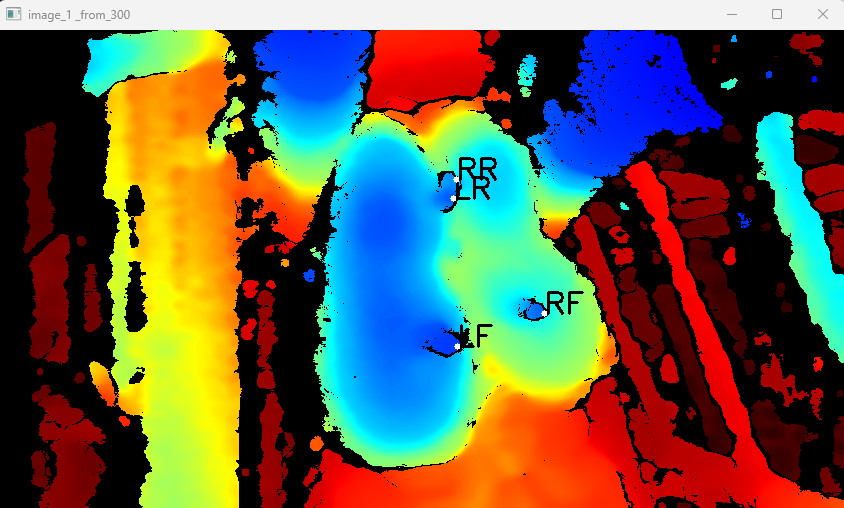
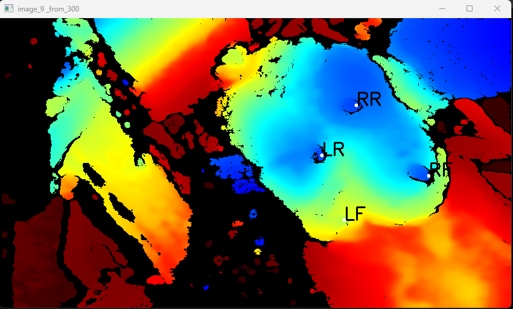
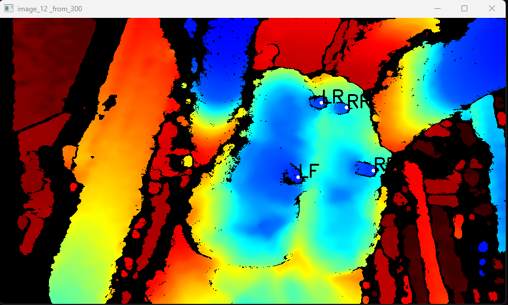

# Udder labels
The frames of 50 cows 25 from each computer (Guilherme, Maria) were labeled for class, segment, and keypoints. 

## Class
0: bad
1: good
Labeling script
### Examples
<table>
  <tr>
    <th></th>
    <th></th>
    <th></th>
  </tr>
</table>

## Segments
Labeling script
### Examples 
<table>
  <tr>
    <th></th>
    <th></th>
    <th></th>
  </tr>
</table>

## Keypoints
Labeling script
### Examples
<table>
  <tr>
    <th></th>
    <th></th>
    <th></th>
  </tr>
</table>
