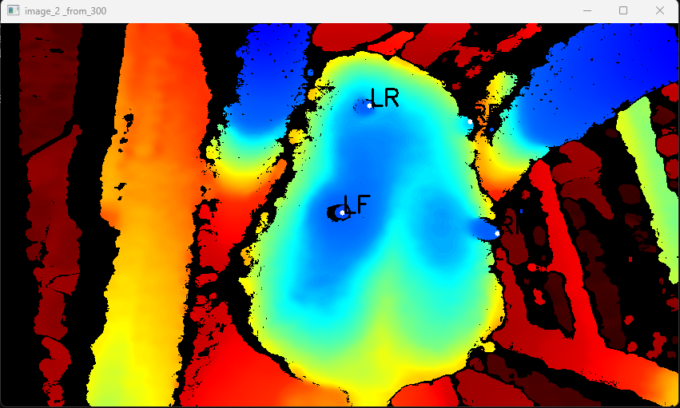
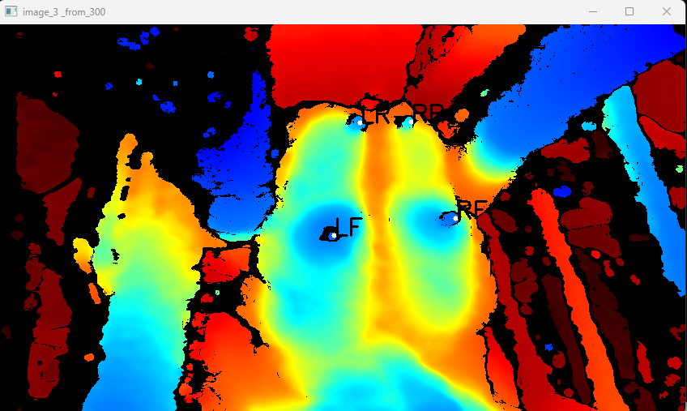

The frames of 50 cows 25 from each computer (Guilherme, Maria) were labeled for class, segment, and keypoints. 

# Class
0: bad
1: good

Labeling script
## Examples

# Segments

Labeling script
## Examples 

# Keypoints

Labeling script
## Examples
<table>
  <tr>
    <th></th>
    <th></th>
    <th></th>
  </tr>
</table>
