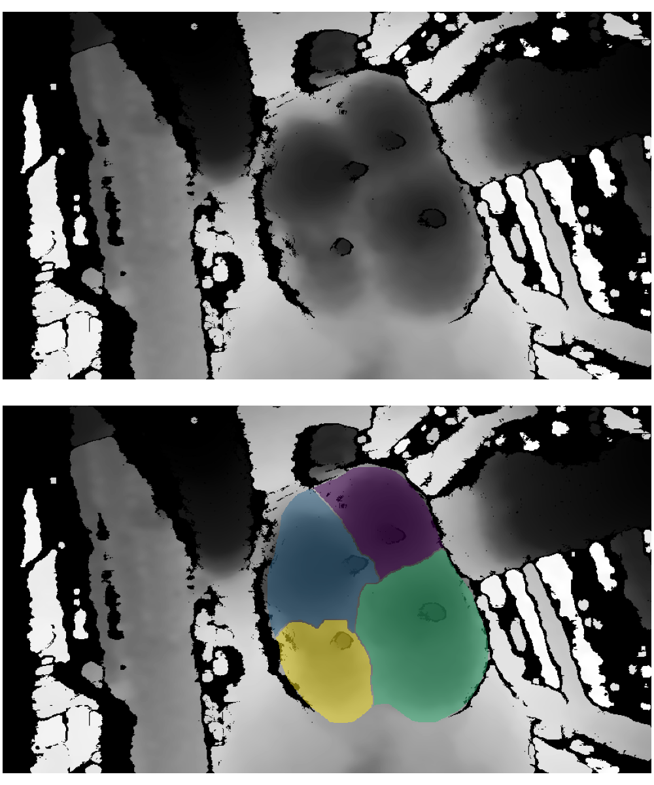

# Udder processing
Directory:
* pred_labels/
  * keypoints
  * bbox
  * segments
* validate_watershed/
  * pred_labels/
    * keypoints
    * bbox
    * segments
* watershed_segments_labeled
* watershed_segments_predicted

## Predict new cows
1. Classify frame
2. If good:
3. If segment exists
4. If keypoints exist

 

Note:
* Frame index in labeled cows starts at 1.
* Frame index in predicted cows starts at 0. (My mistake, but it was too late to fix it)

## Watershed validation

